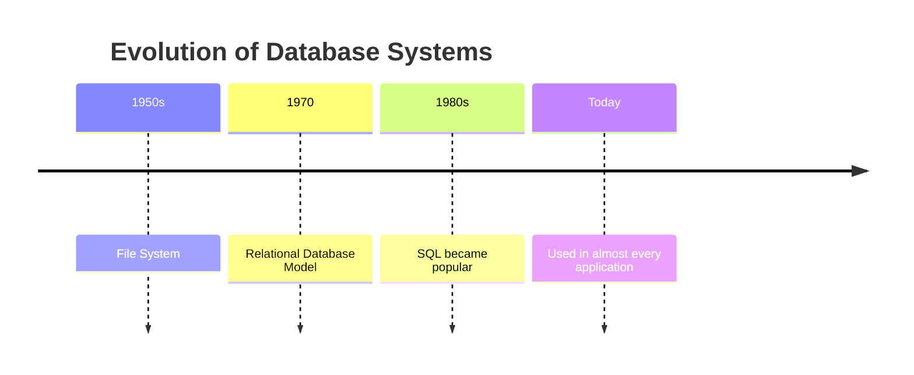
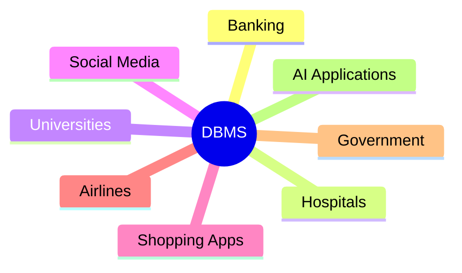
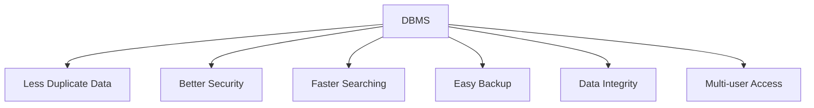

# 📚 History of Database Management Systems (DBMS)

> **"Every app you use today—Instagram, Amazon, Netflix, WhatsApp—stores its data using a Database Management System."**

---

# 🗺️ Learning Roadmap

---

# 🤔 What is a Database?

A **Database** is an organized collection of related data.

### Examples

| Application | Data Stored |
|-------------|-------------|
| 🎓 College | Student Records |
| 🏦 Bank | Customer Accounts |
| 🛒 Amazon | Products & Orders |
| 📱 Instagram | Users & Posts |
| 💬 WhatsApp | Messages |

---

# 💻 What is DBMS?

A **Database Management System (DBMS)** is software that helps us:

- 💾 Store data
- 🔍 Search data
- ✏️ Update data
- ❌ Delete data
- 🔒 Keep data secure

---

# ❓ Why Was DBMS Created?

Earlier, data was stored in **files**.

This created many problems.

| 📁 File System Problems |
|-------------------------|
| Duplicate Data |
| Hard to Search |
| Poor Security |
| Data Inconsistency |
| No Proper Backup |

➡️ **To solve these problems, DBMS was introduced.**

---

# 📈 Evolution of DBMS

---

# 👨‍💻 Who Created Modern DBMS?

In **1970**, **Dr. Edgar F. Codd** (IBM) introduced the **Relational Database Model**.

Instead of storing data in complicated structures, he suggested storing it in **tables**.

🏆 **He is known as the Father of the Relational Database.**

---

# 🌍 Where is DBMS Used?

---

# 🎯 Why Do We Use DBMS?

| Purpose | Benefit |
|----------|---------|
| 💾 Store Data | Save information safely |
| 🔍 Retrieve Data | Find data quickly |
| ✏️ Update Data | Modify records easily |
| 🔒 Security | Protect important data |
| 👥 Multi-user Support | Many users can access data together |
| 🔄 Backup | Recover lost data |

---

# ⭐ Advantages of DBMS

---

# 📊 File System vs DBMS

| Feature | File System | DBMS |
|---------|-------------|------|
| Data Organization | ❌ Poor | ✅ Excellent |
| Security | ❌ Low | ✅ High |
| Backup | ❌ Difficult | ✅ Easy |
| Data Redundancy | ❌ High | ✅ Low |
| Multi-user Support | ❌ Limited | ✅ Supported |

---

# 💡 Key Takeaways

- ✅ A **Database** stores data.
- ✅ A **DBMS** manages that data.
- ✅ DBMS replaced the traditional File System.
- ✅ **Dr. Edgar F. Codd** introduced the Relational Database Model in **1970**.
- ✅ Today, almost every software application uses a DBMS.

---

> **"Data is the new oil, and DBMS is the refinery that organizes and manages it."** 🚀