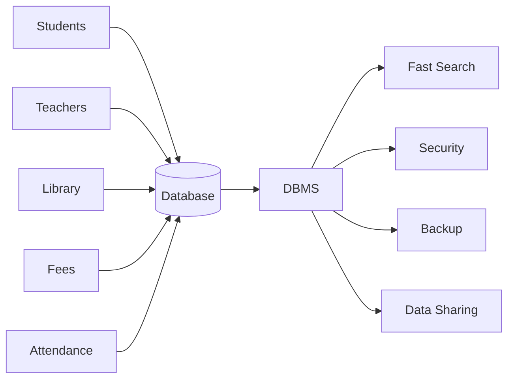
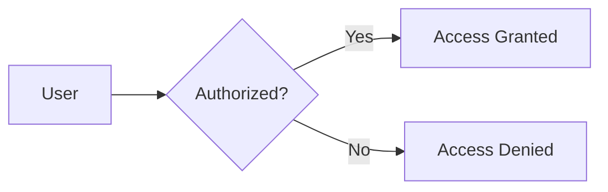
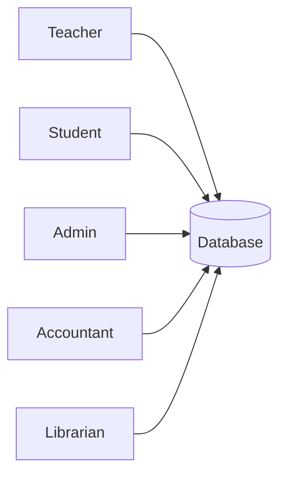
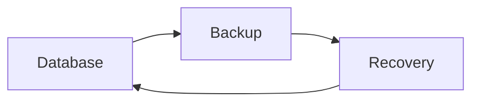
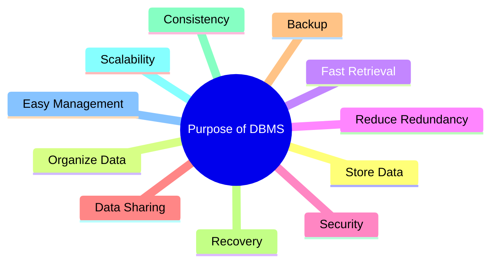

# 🎯 Purpose of DBMS

> **One Line Definition**
>
> A **Database Management System (DBMS)** is software that stores, manages, organizes, and retrieves data efficiently while keeping it secure, consistent, and easy to access.

---

# 🤔 Imagine This...

Suppose your college stores student information in **Excel files.**

```
Student.xlsx
Fees.xlsx
Attendance.xlsx
Marks.xlsx
Library.xlsx
```

Now imagine...

- 50,000 students
- 300 teachers
- Daily attendance
- Semester marks
- Library records
- Hostel records

😵 Everything becomes difficult.

Questions like...

- Where is Disha's attendance?
- Has she paid her fees?
- What is her SGPA?
- Which books has she borrowed?

Finding answers becomes slow and confusing.

---

# 💡 The Solution

Instead of keeping hundreds of files,

we keep everything inside a **Database** and manage it using a **DBMS**.



---

# 🏦 Real Life Examples

| Company | What DBMS Stores |
|----------|-----------------|
| 🏦 Bank | Customer accounts, transactions |
| 🛒 Amazon | Products, Orders, Customers |
| 📸 Instagram | Users, Posts, Likes |
| 🎬 Netflix | Movies, Watch History |
| 🏥 Hospital | Patients, Doctors, Reports |
| 🎓 University | Students, Fees, Attendance |

Every large company depends on a DBMS.

---

# ❌ Problems Without DBMS

Imagine storing everything in files.

| Problem | Example |
|----------|----------|
| Duplicate Data | Same student stored multiple times |
| Data Loss | File gets deleted |
| Slow Search | Searching thousands of files |
| No Security | Anyone can edit data |
| Difficult Backup | Thousands of files to copy |
| Data Inconsistency | Different files contain different information |

---

# ✅ Purpose of DBMS

## 1️⃣ Store Data

Instead of keeping hundreds of files,

store everything in one database.

```text
Before

Student1.xlsx
Student2.xlsx
Student3.xlsx
Student4.xlsx

After

College Database
```

---

## 2️⃣ Organize Data

Data is arranged in tables.

Example

| Roll No | Name | Branch |
|----------|------|---------|
|101|Disha|CSE|
|102|Rahul|ECE|
|103|Priya|IT|

Finding information becomes very easy.

---

## 3️⃣ Retrieve Data Quickly

Instead of reading an entire file,

DBMS searches instantly.

Example

```
Find Student Roll No = 101
```

Result appears in milliseconds.

---

## 4️⃣ Reduce Duplicate Data

Without DBMS

```
Disha
Disha
Disha
Disha
```

With DBMS

```
Disha
```

Stored only once.

---

## 5️⃣ Keep Data Safe

DBMS provides

- Password Protection
- User Authentication
- Permissions
- Encryption



---

## 6️⃣ Share Data

Many users can use the database together.



Everyone sees the same updated information.

---

## 7️⃣ Maintain Data Consistency

Example

Fees Paid = Yes

Every department sees

✅ Fees Paid

Nobody sees

❌ Fees Pending

because all data comes from one database.

---

## 8️⃣ Backup and Recovery

If the system crashes,

DBMS restores data.



No important information is lost.

---

## 9️⃣ Improve Speed

Searching

```
Excel Files ❌
```

may take minutes.

Searching

```
DBMS ✅
```

takes milliseconds.

---

## 🔟 Handle Large Amounts of Data

Modern databases store

- Millions of users
- Billions of records
- Petabytes of data

Examples

- Google
- Amazon
- Instagram
- YouTube

---

# 📊 File System vs DBMS

| Feature | File System | DBMS |
|-----------|------------|------|
| Speed | ❌ Slow | ✅ Fast |
| Security | ❌ Weak | ✅ Strong |
| Backup | ❌ Difficult | ✅ Easy |
| Sharing | ❌ Poor | ✅ Excellent |
| Redundancy | ❌ High | ✅ Low |
| Consistency | ❌ Poor | ✅ High |
| Data Recovery | ❌ Hard | ✅ Easy |
| Scalability | ❌ Low | ✅ Very High |

---

# 🧠 Easy Memory Trick

Remember the word

# **SOSRBS**

| Letter | Meaning |
|----------|----------|
| **S** | Store Data |
| **O** | Organize Data |
| **S** | Search Quickly |
| **R** | Reduce Redundancy |
| **B** | Backup & Recovery |
| **S** | Security & Sharing |

If you remember **SOSRBS**, you can write almost every answer about the purpose of DBMS in exams.

---

# 🎓 Interview Question

### Why do we need a DBMS?

> We need a DBMS because it stores, organizes, secures, retrieves, shares, and manages data efficiently while reducing redundancy and maintaining consistency.

---

# 📌 Final Summary



---

# 💭 Remember Forever

> **A Database stores the data.**
>
> **A DBMS manages the data.**
>
> **Without a DBMS, data is just a collection of files.**
>
> **With a DBMS, data becomes organized, secure, fast, and useful.**